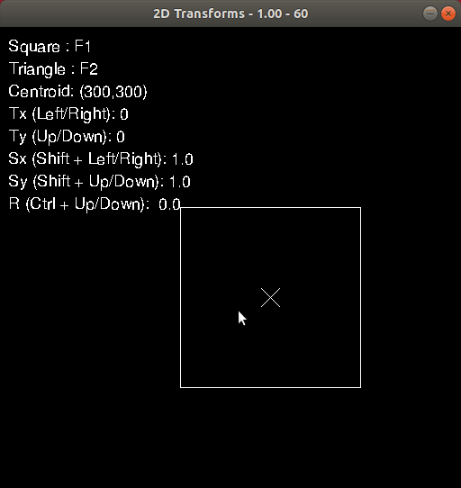

# Graphics Engine

A simple graphics engine abstracting SDL2 with samples for learning graphics
from the ground up.

## Getting started

    $ git clone https://github.com/ronnieholm/GraphicsEngine.git
    $ cd GraphicsEngine
    $ dotnet build
    $ dotnet run -p Graphics.Transforms2D

## 2D Transforms

## Resources

- Inspired by [olcPixelGameEngine](https://github.com/OneLoneCoder/olcPixelGameEngine)
